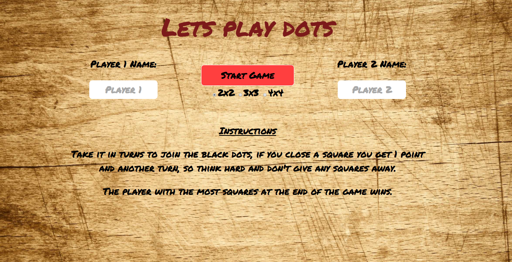

# WDI-project-1
# Dots and Boxes

## GA WDI London - Project 1

*As played by bored kids across the world...*

It’s currently a two player game. You can enter your own name, or stick with the automatic values of “player 1” and “player 2”.

Welcome screen

####Rules

- Click on any line between any of the black dots.
- When you click on your line it will turn dark and won’t be clickable again.
- If you close a 1 x 1 square on the board you get 1 point and an extra go.
- You can keep using your 1 extra go to close as many boxes as possible, but you won’t get 2 extra goes by closing 2 boxes at once.
-  When all the lines have been guessed and all the boxes are closed the points are added and a winner is named.

####Approach / How it works

The game is split over two screens, a welcome screen takes input from a form for player names and also shows the rules.

The game screen slides up and we have a notepad theme with the game grid. The top line tells you who’s turn it is, and there is an aside for the current scores.

The reset button resets scores and player counts on the current grid. The start again button will clear the player names as well and take you back to the welcome screen.

As the game is played, if you close a square it will be filled with your initial, in your colour. The cartoon pencil cursor also changes color depending on who’s turn it is.

Each time a line is drawn there is a short pencil sound, a win gets a Ta-Daa sound and there is a trumpet for a draw.

####The build
HTML 5, CSS and jQuery were used to create the whole game.
The Google Web Font 'Permanent Marker' has been used to style the game.

####Problems & Challenges

The biggest challenge from the game was getting jquery to build the board and then to figure out the relationship between each square so that clicking on a horizontal line affects the squares above and below, while clicking on a vertical line affects the squares either side.

I sorted the problem by giving each element of the board an ascending ID number and then used the number of elements in each row to figure out which box to address.

Generating a simple style that worked on mobile and desktop was also a challenge.
